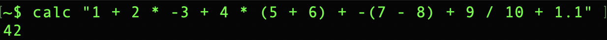
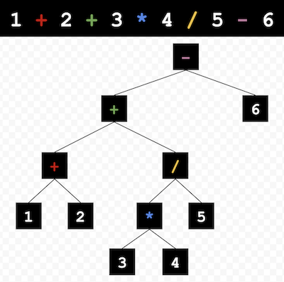

# Command Line Calculator in Swift



## Overview

This repository contains a calculator program written in Swift 4.2 that can be used from the command line, along with this article which explains how the program works. There are suggested programming exercises at the bottom of this page, in case you are interested in adding new features to the calculator.

## Disclaimer 

This calculator was written as a programming exercise, and is not intended for general usage. Use of the calculator outside of its didactic capacity is strongly discouraged. The author claims no responsibility for problems caused by incorrect values produced by the calculator. Use at your own risk.

## Motivation
 
Sure, macOS comes with the built-in Calculator app and `bc` bash program. And there are plenty of free online calculators. The world doesn't need another way to crunch numbers on their Macs. But I didn't let that stop me from solving a very interesting problem!

This calculator accepts input like `"1 + 2 * 3 + -(4 - 5)"`, crunches the numbers according to the standard [order of operations](https://en.wikipedia.org/wiki/Order_of_operations), and prints out `8`. Creating a simple solution for this problem was a fun, tricky challenge.

## Data Transformations

At the highest level, this program turns a string into either a number or an error message. Assuming the user provides valid input, the next level down involves turning a string into a tree of arithmetic expressions. A properly constructed expression tree can be recursively evaluated to calculate the correct answer. An expression tree can be visualized like this:



This program does not leap directly from user input to an expression tree. There are multiple data transformations involved, each of which analyzes incoming data and emits different data morphed one step closer to the final result. These data transformations are piped together, as seen in this method from [main.swift](calc/main.swift):

```swift
func calculate(_ input: String) -> CalcResult<Number> {
    return InputParser.createGlyphs(from: input)
        .then(Tokenizer.createTokens(fromGlyphs:))
        .then(Operationizer.createOperations(fromTokens:))
        .then(Expressionizer.createExpression(fromOperations:))
        .then(Calculator.evaluate(expression:))
}
```

The following sections describe each step in this data transformation pipeline.

### Text -> Glyphs

The user input is a string which may or may not contain valid arithmetic expressions. Each character in the string is  categorized by trying to create a `Glyph` value to represent it.

```swift
enum Glyph {

    case add
    case decimalSeparator
    case digit(UnicodeScalar)
    case divide
    case multiply
    case parenthesisLeft
    case parenthesisRight
    case subtractOrNegate
    case whitespace

}
```

Note: The `digit` case has an associated `UnicodeScalar` value. Since Swift strings are Unicode-compliant each character technically might consist of multiple scalars, but for the set of supported symbols in this program we don't need to worry about that. When you see `UnicodeScalar` in this program, just think of it as a character in a string.

Analysis of each user input character occurs in [input-parser.swift](calc/text%20-%3E%20glyphs/input-parser.swift). It uses `CharacterSet` from the `Foundation` framework to categorize a character. If it encounters an unrecognized symbol, an error is returned.

For example, `"44 + -2"` yields these `Glyph` values:

```swift
[
    .digit("4"),
    .digit("4"),
    .whitespace,
    .add,
    .whitespace,
    .subtractOrNegate,
    .digit("2")
]
```

At this point we still know very little about what the user input means. The presence of a `-` character might mean subtraction or negation (hence the `Glyph` case named `subtractOrNegate`). Numbers are still broken up into individual digit values. This ambiguity can be reduced via the metadata provided by `Glyph` to create more meaningful _tokens_.

### Glyphs -> Tokens

todo

### Tokens -> Operations

todo

### Operations -> Expression

todo

### Expression -> Calculation

todo

## Programming Exercises

todo
